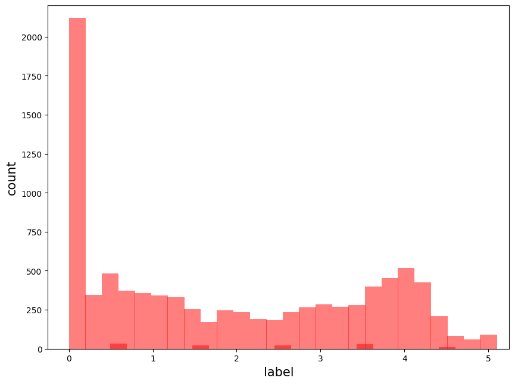
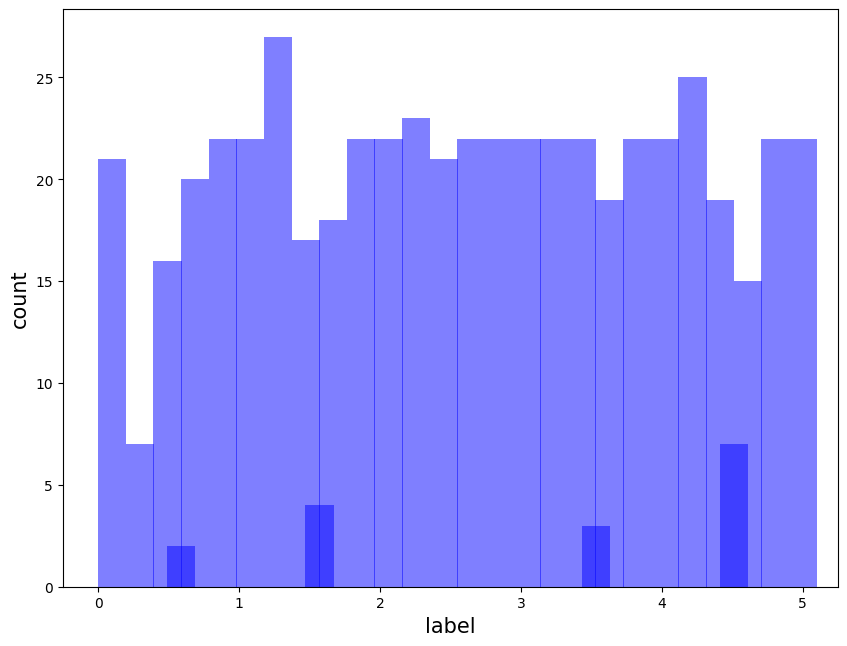
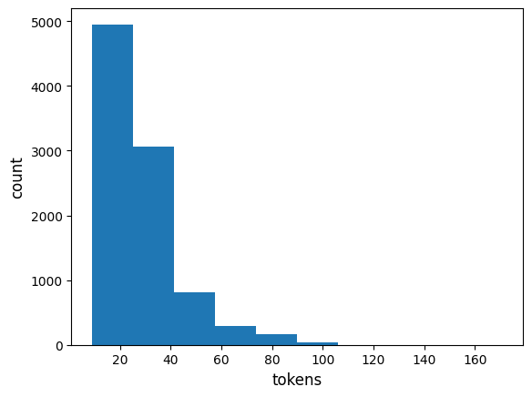
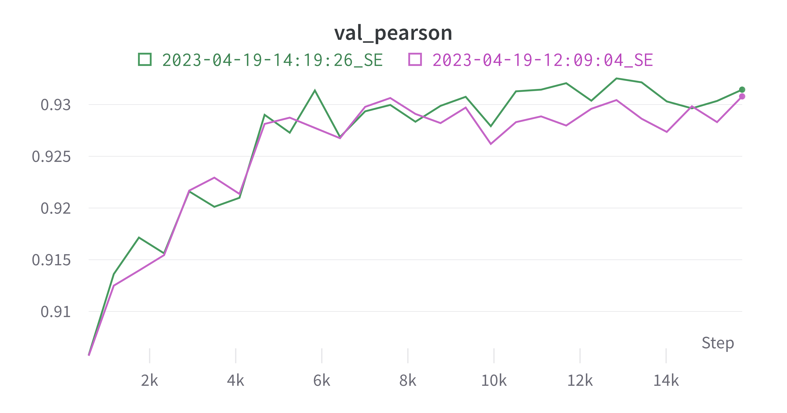
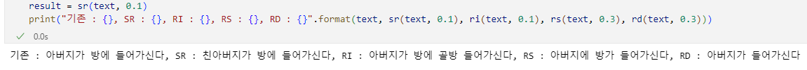

# 문장 간 유사도 측정

# 목차

[1. 정보](#1-정보) > [2. 팀원](#2-팀원) > [3. 디렉토리 구조](#3-디렉토리-구조) > [4. 시각화](#4-시각화) > [5. 사용한 전처리 기법](#5-사용한-전처리-기법) > [6. 모델](#6-모델) > [7. 실험 환경](#7-실험-환경)

# 1. 정보

- 주제: 부스트캠프 5기 Level 1 프로젝트 - 문장 간 유사도 측정
- 프로젝트 기간: 2023년 4월 10일 ~ 2023년 4월 20일
- 데이터셋
  - train data 9324개
  - val data 550개
  - test data 1,100개
- 평가 방법
  - 회귀 문제 - 0과 5 사이의 유사도 점수를 예측
  - 피어슨 상관계수(Pearson Correlation Coefficient, PCC) 지표 사용
- 개발 스택: `Git` `Notion` `Ubuntu` `GPU V100` `Python` `Pytorch Lightning` `Wandb`
- 결과: Public: 5위, Private: 10위

# 2. 팀원

<table>
    <tr height="160px">
        <td align="center" width="150px">
            <a href="https://github.com/gibum1228"></a>
            <br/>
            <a href="https://github.com/gibum1228"><strong>김기범</strong></a>
            <br />
        </td>
        <td align="center" width="150px">
            <a href="https://github.com/seongeun-k"></a>
            <br/>
            <a href="https://github.com/seongeun-k"><strong>김성은</strong></a>
            <br />
        </td>
        <td align="center" width="150px">
            <a href="https://github.com/KimuGenie"></a>
            <br/>
            <a href="https://github.com/KimuGenie"><strong>김의진</strong></a>
            <br />
        </td>
        <td align="center" width="150px">
            <a href="https://github.com/ella0106"></a>
            <br/>
            <a href="https://github.com/ella0106"><strong>박지연</strong></a>
            <br />
        </td>
        <td align="center" width="150px">
            <a href="https://github.com/jys8332"></a>
            <br/>
            <a href="https://github.com/jys8332"><strong>정윤석</strong></a>
            <br />
        </td>
    </tr>
</table>

# 3. 디렉토리 구조

```bash
├── level1_semantictextsimilarity-nlp-06
│   ├── data/ (private)
│   ├── results/ (private)
│   ├── data_viz/
│   │   ├── _EDA.ipynb
│   │   └── _data_preprocessing.ipynb
│   ├── models/
│   │   └── model.py
│   ├── utils/
│   │   ├── train.py
│   │   ├── process_manipulator.py
│   │   ├── utils.py
│   │   └── data_preprocessing.py
│   ├── baselines/
│   │   └── baseline_config.yml
│   ├── requirements.txt
│   ├── READMD.md
│   └── main_process.py
```

# 4. 시각화

주어진 데이터의 특징을 파악하기 위해 EDA를 수행해봤다.

## 4.1 label별 데이터 분포

validation data의 분포는 uniform에 가까운데 비해 train data의 분포는 편향되어 있다. 특히 label 0.0의 데이터가 압도적으로 많다.

## 4.1.1 Train Data



## 4.1.2 Validation Data



## 4.2 Token 개수



sentence1 + sentence2의 token 개수를 히스토그램으로 확인 했을 때 대부분 토큰 개수가 100개 이하였고, 가장 긴 문장의 토큰 개수는 169개였다. 특수문자는 토큰 하나로 변환되는데, ! 등의 문장 부호가 반복되는 경우 문장의 토큰 개수가 많아졌다. 특수문자를 제거할 경우 token 개수를 최대 100개 정도로 크게 줄일 수 있었다. 이로 인해 학습 속도가 훨씬 빨라지는 효과를 얻을 수 있었다.<br>
model max length가 충분하지 않을 경우, sentence2의 token만 손실 되어 두 문장 사이의 유사도가 변질된다고 판단하여 model max length는 100 이상으로 선정했다.

## 4.3 Source별 label 분포


train data의 source 별 label 분포. sampled data는 positive skewness를 보이고 rtt data는 negative skewness를 보인다.

# 5. 사용한 전처리 기법

데이터 전처리는 12개의 기법을 사용했는데 두 가지 카테고리인 데이터 클리닝과 데이터 증강으로 분류했다. 분류 기준은 다음과 같다. 원본 데이터를 변환시키는 전처리 기법은 `데이터 클리닝`이라고 하며, 원본 데이터를 유지한 채 새로운 데이터를 만들어내면 `데이터 증강`으로 카테고리를 지정했다.

## 5.1 데이터 클리닝(Data Cleaning)

### 5.1.1 맞춤법 검사(Spell Check)

`PyKoSpacing` 을 이용해 띄어쓰기를 진행 한 후 `SymSpell` 로 맞춤법 체크를 진행하였다. 그러나 육안으로 확인했을 때 띄어쓰기 및 맞춤법 오류가 많이 개선되지 않았다. 그 대안으로 EDA 를 진행하면서 너무 많은 특수문자, 이모티콘 등을 제거하였고, 초성 등을 단어로 바꿔주었다. 그 이후에 네이버 맞춤법 체크 api를 활용한 `HanSpell` 로 맞춤법 체크를 하였다. 맞춤법 오류가 많이 개선되었으며, 토큰화 기준 가장 긴 문장의 길이가 180에서 120으로 줄었다.

### 5.1.2 hangulize

`hangulize`는 'OPIC'을 '오픽'으로 변환해주는 등 외래어를 한글 발음으로 바꿔주는 라이브러리이다. 



모델이 예측한 validation data의 label과 실제 정답 값을 비교했을 때 영어 단어가 한글로 되어서 실제 정답 점수는 높은데 모델이 label을 낮게 주는 경우가 다소 있었다. 이에 우리는 모델이 두 단어를 서로 다른 단어로 인식하여 낮은 점수를 주었다고 가정하여, `hangulize` 라이브러리를 통해 데이터를 클리닝했다.

### 5.1.3 Label Smoothing

우리가 직접 만든 데이터 전처리 기법으로 데이터의 레이블 별 분포를 보았을 때, 레이블이 0인 데이터가 많고, 5인 데이터는 거의 없었다. 따라서 label을 균등 분포로 만들어주기 위해, label 0의 데이터를 잘라내서 label 5의 데이터로 만들어주는 작업을 진행했다. copied translation을 이용하여 레이블 0의 데이터 중 sentence1 데이터를 sentence2로 copy하여 label 5로 만들어주었다. 잘라내는 label 0 데이터의 비율을 조정하며 최적의 값을 찾아보았다.

### 5.1.4 Over/Under Sampling

validation data는 label별 데이터 분포가 uniform distribution에 가까운 것에 비해 train data는 다소 편향된 분포를 보였다. train data에서 label별 데이터 개수를 x라는 값을 기준으로 데이터가 개수가 x보다 크면 Undersampling, x보다 작으면 Oversampling했다. 특정 데이터에 과적합 되는 것을 막기 위해 Oversampling시 한 데이터가 3회 이상 복제되지 않도록 제한했고, 결과적으로 완전한 uniform distribution이 만들어지진 않았다. train data를 uniform으로 변형하기 전과 비교했을 때, validation pearson coefficient를 0.9208에서 0.9362로 1.7% 개선할 수 있었다.

### 5.1.5 불용어 제거

Okt 라이브러리를 사용하여 형태소 단위로 끊어 불용어에 해당하는 형태소들을 제거하는 기법이다. 불용어를 제거하는 과정에서 의미가 있는 단어들을 제거하는 경우가 있어서 그런지 성능이 오히려 떨어지는 결과가 생겨 중반부터 사용하는 기법에서 제외하였다.

### 5.1.6 특수 문자 제거

정규식을 활용해 특수 문자를 제거했다.

## 5.2 데이터 증강(Data Augmentation)

### 5.2.1 Swap Sentence

두 문장 사이의 유사도는 두 문장의 순서가 바뀌어도 동일하기 때문에 문장의 품질을 떨어뜨리지 않으면서 데이터를 늘릴 수 있었다. 이후 대부분의 실험에서 swap sentence를 사용했다.

### 5.2.2 Easy Data Augmentation(EDA)



- synonym replacement : 무작위 단어를 유의어로 대체
- random insert : 유의어를 무작위 위치에 삽입
- random swap : 단어들의 위치를 무작위로 변경
- random deletion : 단어 무작위 삭제

품사 태깅은 Okt 사용, 확률 p값은 초기에는 0.3으로 진행 후 논문 상 sweet spot이 0.1이라 변경해서 적용했다. 초반에는 단순히 sentence_1 컬럼과 sentence_2 컬럼에 둘 다 적용하여 데이터 증강을 진행했는데, 이는 오히려 label의 의미를 해치는 것이 아닌가 하여 한 컬럼에 변형을 가하면 그 쌍이 되는 문장은 기존 문장으로 삽입하여 데이터 증강을 시도해 보았다. Random Swap 외에는 유의미한 성능 향상을 보이지 않았다.

### 5.2.3 Back Translation

googletrans를 통해 역번역을 하여 데이터 증강을 시도했으나, 번역된 문장의 질이 많이 떨어져 data로 활용하지 못했다.

### 5.2.4 Text style tranfer

huggingface의 한국어 말투 변환 모델 `heegyu/kobart-text-style-transfer`. 구어체, 문어체 등 최대 12가지 말투 변환 가능. 문장의 말투를 바꾸면 data의 label이 바뀌지 않으면서 data를 증강할 수 있을 것이라 생각했으나, 말투 변환 모델이 완벽하지 않아 문장의 의미가 바뀌는 경우가 생겨 유의미한 데이터 증강이 되지 못했다.

### 5.2.5 Reverse Text

문장의 어절 단위로 끊어 순서를 바꾼 상태로 학습하는 방법이다. 단일 혹은 다른 기법들과 조합 시 성능이 좋지는 않아 중반부터 사용하는 기법에서 제외하였다.

### 5.2.6 SMOTE

SMOTE는 정형 데이터에서 사용하는 데이터 증강 기법으로 imbalanced 문제를 해결하는데 매우 적절하다. 벡터 공간에서 label이 군집화 됐을 때 새로운 빈 공간을 찾아 낸다면 그 데이터가 동일한 label을 가지는 새로운 데이터이기 때문에 우리 문제에서도 사용해봤다. 하지만 직접 실험해본 결과 문장 의미, 단어 의미가 많이 변환되어 실험에는 채택되지 못 했다.

# 6. 모델

- snunlp/KR-ELECTRA-discriminator
- monologg/koelectra-base-v3-discriminator

## 6.1 기본 모델 성능
|Model|Loss|Learning Rate|Batch Size|Val Pearson|
|:---|:---|:---|:---|:---|
|snunlp/KR-ELECTRA-discriminator|MSE|1e-5|32|0.92639|
|monologg/koelectra-base-v3-discriminator|MSE|1e-5|32|0.92112|

# 7. 실험 환경

| |Model|Val Pearson|Learing Rate|Batch Size|Data Augmentation|Data Cleaning|max_len|public 리더보드 점수|Loss|비고|
|:---|:---|:---|:---|:---|:---|:---|:---|:---|:---|:---|
|1|snunlp/KR-ELECTRA-discriminator|0.9917|1e-5|32|swap|remove_special_word| |0.9241|MSE|train, test split|
|2|snunlp/KR-ELECTRA-discriminator|0.9945|1e-5|16|swap, create_5_1200|none|180|0.9234|MSE|train, test split|
|3|snunlp/KR-ELECTRA-discriminator|0.9931|1e-5|32|swap|remove_special_word|180|0.9220|MSE|train, test split|
|4|snunlp/KR-ELECTRA-discriminator|0.9329|1e-5|32|swap, create_5_1|process_eng|140|0.9220|MSE| |
|5|snunlp/KR-ELECTRA-discriminator|0.9292|1e-5|32|swap|none| |0.9217|MSE| |
|6|monologg/koelectra-base-v3-discriminator|0.9223|2e-5|16|swap|remove_special_word| |0.9130|MSE| |
|7|monologg/koelectra-base-v3-discriminator|0.9919|2e-5|64|swap|nremove_special_word|180|0.9110|MSE|train, test split|
|8|monologg/koelectra-base-v3-discriminator|0.9242|14e-6|32|create_5_1, swap|remove_special_word, hangulize|100|0.9104|MSE| |

## 7.1 앙상블 결과

|합친 모델 목록|앙상블 방법|기존 성능|개선 성능|
|:---|:---|:---|:---|
|1, 5, 6|soft voting|0.9241|0.9294|
|2, 4, 6|soft voting|0.9234|0.9297|
